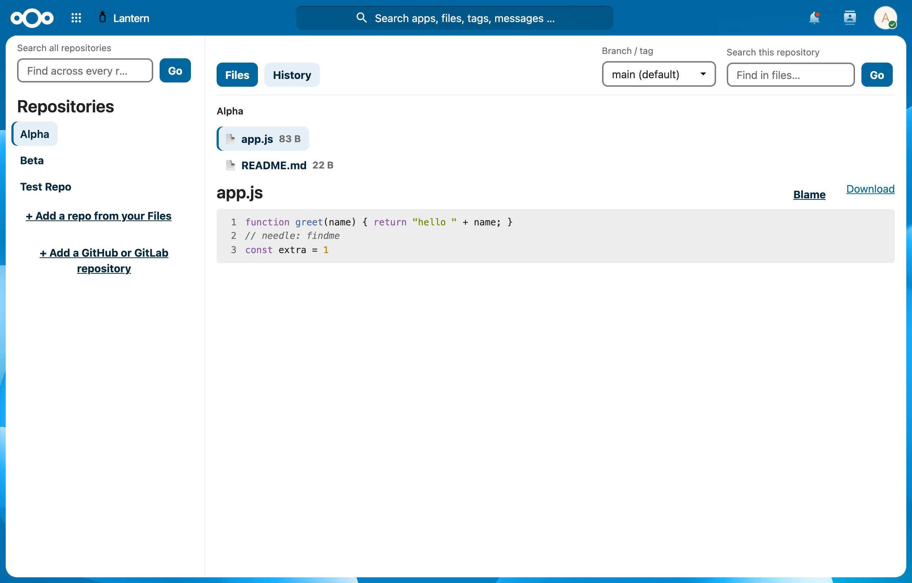

# Lantern

**A read-only git repository browser for Nextcloud — your server's repos, your
own Files, and GitHub, all in one place.**

Lantern lets you browse git repositories from inside Nextcloud: read files with
syntax highlighting, render Markdown, view commit history, diffs, and blame, and
search across a repo — all behind your existing Nextcloud login. It is
**read-only** by design: no commits, pushes, or edits.



## Three sources, one interface

| Source | What it is | How you add it |
| --- | --- | --- |
| **Server-side repos** | git repos on the Nextcloud server's filesystem (e.g. `/srv/git/x`) | Admin → Settings → Administration → Lantern |
| **Your Nextcloud Files** | a `.git` repository inside your own Files | Sidebar → "Add a repo from your Files" |
| **GitHub** | a remote GitHub repository (public, or private with a token) | Sidebar → "Add a GitHub repository" |

All three are read through the same `IRepoProvider` interface, so the browsing
experience is identical regardless of where the repo lives.

## Features

- **Read the code:** file tree, syntax-highlighted file viewer, rendered
  Markdown, line numbers, and shareable `#L20-L42` line-range permalinks.
- **History:** branch/tag picker, commit history (paginated), colour-coded
  commit diffs, and line blame.
- **Find things:** in-repo search, plus entries in Nextcloud's global search and
  a dashboard widget showing recent commits.
- **Share a view:** deep links (`?repo=&ref=&path=&blob=#L..`) so a specific
  file and line are linkable.
- **Access control:** admins can restrict server-side repos to specific groups.

## What Lantern is — and isn't

- ✅ Browses git repos from your **server**, your **Nextcloud Files**, and
  **GitHub**.
- ❌ **Read-only** — it never writes to a repository.
- ❌ **GitLab is not supported yet** (same pattern as GitHub; planned).
- ❌ Not a full forge — no issues, PRs, or repository management.

## Requirements

- Nextcloud 30–34.
- The **`git` binary installed and runnable by the web-server user.** The
  official Nextcloud Docker image does **not** ship git — install it (or set an
  absolute git path in Lantern's admin settings). Lantern's setup check warns
  under Administration → Overview if git is missing.
- For GitHub: nothing for public repos; a GitHub **personal access token** for
  private repos (stored encrypted at rest).

## Install

```bash
npm install && npm run build      # build the frontend (creates js/ incl. lazy chunks)
# copy this folder into your Nextcloud custom_apps/ (or apps/) directory, then:
php occ app:enable lantern
```

Server-side repos are configured in **Settings → Administration → Lantern** as a
JSON array of `{id, name, path}`, optionally confined to an `allowed_base`
directory and/or restricted to specific groups. Per-user sources (your Files,
GitHub) are added from the sidebar in the app itself.

## Status

Verified end-to-end on a live Nextcloud 34 install (Docker, PHP 8.x, git 2.x),
including a headless-browser pass: all three sources browse correctly, Markdown
renders, syntax highlighting / line numbers / blame / diffs / search work, group
restrictions are enforced, with zero console errors and no missing assets. The
framework-free git core is covered by a committed test suite:

```bash
php tests/run-core-tests.php       # functional + security + provider tests
```

## Security notes

Lantern runs `git` as a subprocess with **no shell** (argument arrays, never a
command string) and validates every ref and path against strict allowlists.
Because a repository's own `.git/config` is otherwise honored by git, every
invocation disables the config directives that can execute programs
(`core.fsmonitor`, `core.hooksPath`, `core.attributesFile`, `diff.external`), so
repositories from untrusted sources (your Files, GitHub) can be browsed safely.
GitHub tokens are encrypted at rest. See `docs/PROJECT_BIBLE.md` §9 for the full
threat model.

## Documentation

Design, security model, API/provider contract, decision records, and roadmap:
**[docs/PROJECT_BIBLE.md](docs/PROJECT_BIBLE.md)**. Release/signing steps:
**[SIGNING.md](SIGNING.md)**. Build history: **[CHANGELOG.md](CHANGELOG.md)**.

## License

AGPL-3.0-or-later — see [COPYING](COPYING).